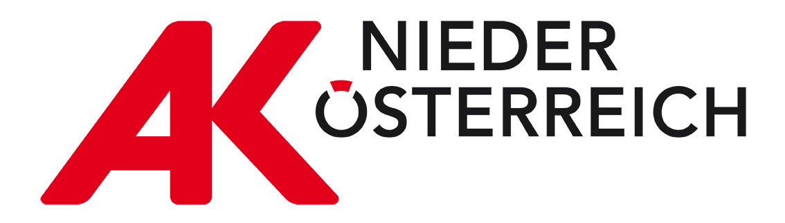
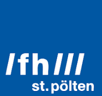

<!-- markdownlint-disable MD033-->
# ergo4all

<table style="border-collapse: collapse; border: none">
    <tr>
        <th style="border: none">Funded within the Projektfonds Arbeit 4.0 Programme</th>
        <th style="border: none">Project partners</th>
    </tr>
    <tr>
        <th style="border: none">
            
        </th>
        <th style="border: none">
            
            
        </th>
    </tr>
</table>

The main repository for the [Ergo4All](https://research.fhstp.ac.at/projekte/ergo4all-ergonomie-fuer-alle)
project.

Checkout the projects [Changelog](./CHANGELOG.md) to see what's new.

## Project structure

This is a [monorepo/workspace](https://dart.dev/tools/pub/workspaces) project
with the following parts.

| Name                                                        | Description                                      |
| ----------------------------------------------------------- | ------------------------------------------------ |
| [ergo4all](./apps/ergo4all/README.md)                       | The main Ergo4All app                            |
| [pose_tester](./apps/pose_tester/README.md)                 | A testing app for pose detection and scoring     |
| [common](./packages/common/README.md)                       | Common dart logic                                |
| [common_ui](./packages/common_ui/README.md)                 | Common ui logic                                  |
| [custom_locale](./packages/custom_locale/README.md)         | Logic for managing a custom locale setting       |
| [pose](./packages/pose/README.md)                           | Common pose types and logic                      |
| [pose_analysis](./packages/pose_analysis/README.md)         | Logic for analyzing and scoring poses            |
| [pose_detect](./packages/pose_detect/README.md)             | Logic to extract poses from images               |
| [pose_transforming](./packages/pose_transforming/README.md) | Logic for transforming and normalizing pose data |
| [pose_vis](./packages/pose_vis/README.md)                   | UI logic for visualizing poses                   |
| [rula](./packages/rula/README.md)                           | Logic modelling the RULA sheet                   |

## Licence

This repository uses dual licensing.

#### Software (code)

All source code in this repository is licensed under the **MIT License with Commons Clause**. This means the software is free to use, modify, and distribute for non-commercial purposes. However, you may not sell the software or provide it as part of a commercial service or paid support offering. 

See [LICENSE_SOFTWARE](./LICENSE_SOFTWARE.md) for details.

#### Content and Media
All non-code assets (i.e., texts, images, branding, logos, and other) are licensed under the Creative Commons Attribution–NonCommercial–NoDerivatives 4.0 International (CC BY-NC-ND 4.0) license. You may share these assets with attribution, but you may not modify or use them commercially.

See [LICENSE_CONTENT](./LICENSE_CONTENT.md) for details.

[![CC BY-ND 4.0][cc-by-nd-image]][cc-by-nd]

[cc-by-nd]: https://creativecommons.org/licenses/by-nd/4.0/
[cc-by-nd-image]: https://licensebuttons.net/l/by-nd/4.0/88x31.png
[cc-by-nd-shield]: https://img.shields.io/badge/License-CC%20BY--ND%204.0-lightgrey.svg

If you are interested in alternative licenses, please contact the project team.

## Develop

To get started developing,
[install Flutter](https://docs.flutter.dev/get-started/install),
preferably using [fvm](https://fvm.app/). Then clone the repo and run
`fvm use` inside the project directory to setup the correct flutter sdk.

It is recommended to use VSCode with the
[recommended extensions](./.vscode/extensions.json).

### Commit conventions

This project uses
[conventional commits](https://www.conventionalcommits.org/en/v1.0.0/),
specifically the
[Angular style](https://github.com/angular/angular/blob/22b96b9/CONTRIBUTING.md#-commit-message-guidelines).
It is used by
[semantic-release](https://github.com/semantic-release/semantic-release)
for automated releases.

We use the following commit types:

| type     | description                                                                                                                                          | release                    |
| -------- | ---------------------------------------------------------------------------------------------------------------------------------------------------- | -------------------------- |
| feat     | A new feature. A user can now do something they could not before. Also use this when dropping a feature, but in that case include the BREAKING text. | minor or major if breaking |
| fix      | A bug fix. Something that was broken is now not.                                                                                                     | patch                      |
| refactor | Internal change to code logic which has no effect on users                                                                                           | none                       |
| style    | A purely stylistic / formatting change to code                                                                                                       | none                       |
| docs     | A change to some documentation item, such as readme or dart doc                                                                                      | none                       |
| deps     | Made a change to installed dependencies, such as updating                                                                                            | none                       |
| misc     | A change which fits into none of the above categories                                                                                                | none                       |

We also use scopes matching the name of the affected app or package. If a
change affects multiple scopes, then omit it.

## Contributors

|                                                                                                                                                                                 |                                                                                          |                                                           |
| ------------------------------------------------------------------------------------------------------------------------------------------------------------------------------- | ---------------------------------------------------------------------------------------- | --------------------------------------------------------- |
|                                                   | [Alina Godun](https://www.tuwien.at/mwbw/im/ie/mmi/team)                                 | ML and Visualization Development                          |
|  | [Ana Vesic](https://www.tuwien.at/mwbw/im/ie/mmi/team)                                   | UX conceptualisation, initial data visualisation concepts |
|                                                   | Andreas Kaiser                                                                           | App development                                           |
|                                                      | [Carina Stoiber](https://www.linkedin.com/in/carina-stoiber)                             | UI/UX                                                     |
|                                                               | [David Kostolani](https://www.tuwien.at/mwbw/im/ie/mmi/team)                             | AI model architecture and development roadmap             |
|                                             | [Ramon Brullo](https://www.fhstp.ac.at/de/uber-uns/mitarbeiter-innen-a-z/brullo-ramon-1) | App development                                           |
|                                          | [Santiago Calvo](https://www.tuwien.at/mwbw/im/ie/mmi/team)                              | App development                                           |
|                                                   | [Vivian Seidl](https://www.fhstp.ac.at/en/about-us/staff-a-z/seidl-vivian)               | UI/UX and Visualizations                                  |
