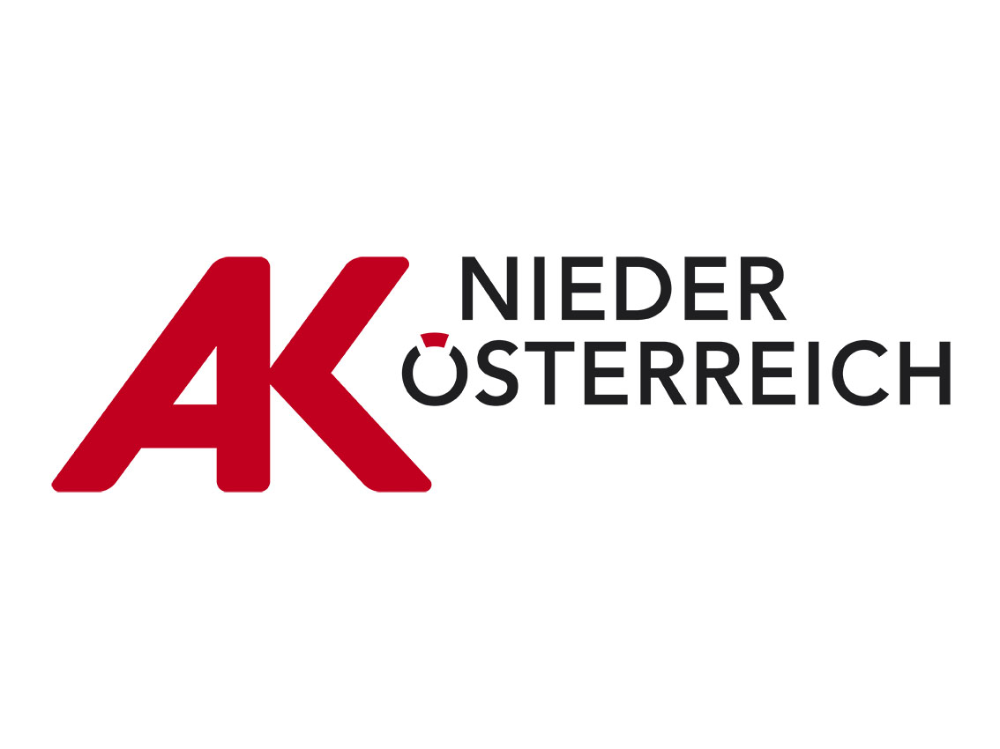

# ergo4all

<table style="border-collapse: collapse; border: none">
    <tr>
        <th style="border: none">Powered by</th>
        <th style="border: none">Project partners</th>
    </tr>
    <tr>
        <th style="border: none">
            
        </th style="border: none">
        <th>
            
            
        </th>
    </tr>
</table>

The main repository for the [Ergo4All](https://research.fhstp.ac.at/projekte/ergo4all-ergonomie-fuer-alle) project.

Checkout the projects [Changelog](./CHANGELOG.md) to see what's new.

## Develop

The ergo4all app is a Flutter project targeting Android and iOS.

To get started developing, [install Flutter](https://docs.flutter.dev/get-started/install), preferably using [fvm](https://fvm.app/). Then clone the repo and run `fvm use` inside the project directory to setup the correct flutter sdk. Also don't forget to use `fvm flutter pub get` get install dependencies.

It is recommended to use VSCode with the [recommended extensions](./.vscode/extensions.json).

### Building

You can deploy ergo4all for [Android](https://docs.flutter.dev/deployment/android#build-an-apk) or [iOS](https://docs.flutter.dev/deployment/ios).